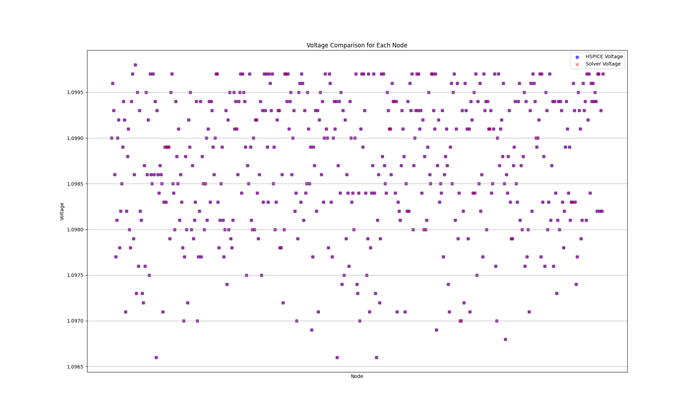

# HSPICE_Solver

HSPICE_Solver is a Python-based tool designed to solve circuits described in HSPICE. It reads circuit descriptions, processes them, and outputs results, including voltage solutions and matrix data.

## Table of Contents

- [Installation](#installation)
- [Usage](#usage)
- [Code Structure](#code-structure)
- [Benchmarking](#benchmarking)

## Installation

To get started, clone this repository:

```bash
git clone https://github.com/AmirmahdiJoudi/HSPICE_Solver.git
cd HSPICE_Solver
```

## Usage

To use the `CircuitSolver`, follow the example below:

```python
from solver import CircuitSolver

# Initialize the circuit solver
circuit = CircuitSolver()

# Parse the netlist from the .sp file
circuit.parse_netlist('path/to/your/file.sp')

# Build the G and J matrices
circuit.build_g_j_vectors()

# Solve the circuit
voltages = circuit.solve()

# Display the results
circuit.display_results(voltages)

# Get the number of nodes in the circuit
num_nodes = circuit.get_num_nodes()
print(f'Number of nodes: {num_nodes}')
```

## Code Structure

### `solver.py`

This file contains the `CircuitSolver` class, which includes the following methods:

- `parse_netlist`: Reads the `.sp` file and extracts nodes, resistances, currents, and voltage sources.
- `build_g_j_vectors`: Constructs the G and J matrices using the extracted nodes, leveraging sparse matrices for efficient storage.
- `print_matrices`: Outputs the G and J matrices.
- `get_node_index`: Returns the index of a node (-1 for ground).
- `solve`: Solves the equation VG = J using a sparse solver.
- `export_matrices_to_csv`: Exports the G and J matrices to CSV files if required.
- `display_results`: Displays results in the terminal (use log files for faster output, similar to HSPICE).
- `get_num_nodes`: Returns the total number of nodes in the circuit.

### Additional Scripts

- **scatter_plot.py**: Generates scatter plots, which are saved in the `benchmark` directory.
- **timing_plot.py**: Creates timing plots, saved in the `timing data` directory.

## Benchmarking

The `benchmarks` directory includes various benchmark files:

### Simple Benchmarks

- `.sp` files: Circuit definitions in HSPICE format.
- `.log` files: Outputs generated by the solver.
- `.csv` files: Extracted G matrices.

### Real Circuit Data Benchmarks

- `.sp` files: HSPICE circuit definitions.
- `.log` files: Outputs from the solver.
- `.ic0` files: Outputs from HSPICE.
- `.png` files: Scatter plots comparing results from HSPICE and the solver (generated with `scatter_plot.py`) like this:.
- 

